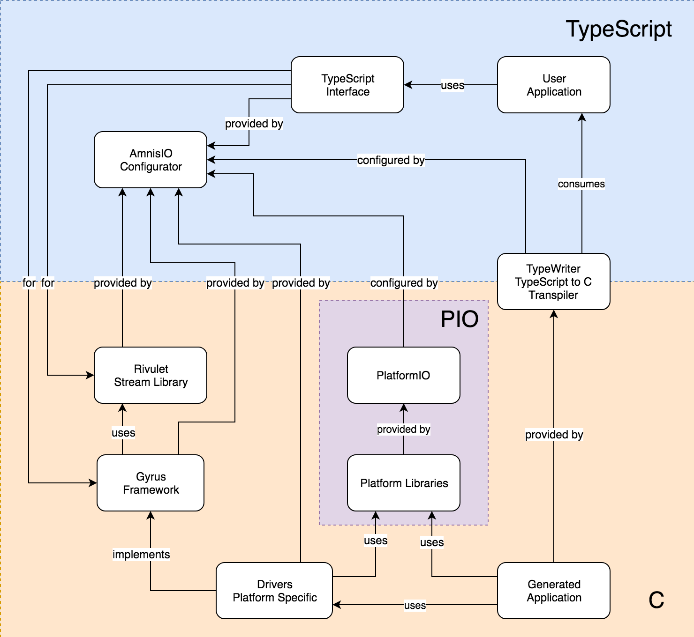

# AmnisIO

Write reactive programs for various platforms using [TypeScript](https://www.typescriptlang.org/).

Inspired by [Cycle.js](http://cycle.js.org/) and powered by [PlatformIO](http://platformio.org/)

## The what, the why, and the how

`AmnisIO` will enable you to write IoT programs in a reactive way.

Every IoT program, from blinking LEDs to switching, is basically a program that reacts to inputs from the device, and pushes outputs to the device. Why not write it declaratively, instead of writing it imperatively? One of the main inhibitors to this approach is the need to write programs for IoT devices in C. A dynamic language like JavaScript allows you to use FRP in order to write the same programs reactively. Enabling people to write IoT programs in JavaScript, and having it transpiled into a C program that can run on the IoT device (as opposed to having a serial connection) is the goal of this project.

Towards this, we have built a small stream library in C called [rivulet](https://github.com/AmnisIO/rivulet), and we expose it via TypeScript. It is a compact library with limited but useful functions which will enable us to get started with reactive programming quickly. Initially, we will be limited to the use of only this library, but we hope to expand our horizons in future.

We hope to enable you to write, in TypeScript, a blinking LEDs program:
```ts
import { periodic } from '@amnisio/rivulet';
import { Sources, Sinks, HIGH, LOW, run } from '@amnisio/arduino-uno';

// Read the LED pin value every 500 ms and toggle it
const blink = (arduino: Sources): Sinks => ({
  LED$:
    periodic(500)
      .sample(arduino.LED$)
      .map(x => x == LOW ? HIGH : LOW)
});

run(blink);

```
and be able to run the program in your Arduino/Genuino UNO, for example. We use a transpiler called [typewriter](https://github.com/AmnisIO/typewriter) and convert this into C code that is compatible with the embedded platform that you choose to work on, and the platform runs the code natively.

The *Arduino UNO* used here is an example, we will be building towards every platform that is targetable. We will be using the wonderful [PlatformIO](https://github.com/platformio/platformio) in order to accomplish this.

## Status

| Area | Status | Repository |
| :--- | :--- | :--- |
| Stream Library (C) | Ready | [rivulet](https://github.com/AmnisIO/rivulet) |
| Stream Library (TS) | Ready | [rivulet](https://github.com/AmnisIO/packages/tree/master/rivulet) |
| Board/Framework (C) | Ready for Arduino UNO | [gyrus](https://github.com/AmnisIO/gyrus/tree/master/arduino_uno) |
| Board/Framework (TS) | Ready for Arduino UNO | [gyrus](https://github.com/AmnisIO/packages/tree/master/arduino-uno) |
| Transpiler (TS/C) | Ready | [typewriter](https://github.com/AmnisIO/typewriter) |
| AmnisIO CLI (TS) | Ready | [AmnisIO](https://github.com/AmnisIO/AmnisIO) |

## Getting Started

We are working on getting a CLI for bootstrapping. For now, we can work with the Arduino Uno.

Please install platformio. Instructions [here](http://docs.platformio.org/en/latest/installation.html).
The platformio executable should be added to the PATH.

```bash
mkdir amnisio_test
cd amnisio_test
npm init
npm install amnisio --save-dev
```

Add a configuration file
```bash
touch .amnisio.config.json
```
with the following contents
```json
{
    "source": "app.ts",
    "output": "app.c",
    "board": "uno"
}
```

Add the following scripts to your `package.json`:
```json
{
  "initialize": "amnisio init",
  "build": "amnisio build",
  "deploy": "amnisio deploy"
}
```

Now, time to initialize the project.
```bash
npm run initialize
```
The arduino uno board configuration (which is the one available at the moment, and entered in the config file) is initialized. The necessary files are downloaded, so please be patient while the initialization happens. Once the initialization is complete, connect your arduino to the computer and get ready (Windows users make sure the required USB drivers are installed).

Add a source file (this is the source that we mentioned in the config, so it should be at the app root)
```bash
touch app.ts
```
with the following contents
```ts
import { periodic } from '@amnisio/rivulet';
import { Sources, HIGH, LOW, run, createSinks } from '@amnisio/arduino-uno';

const blink = (arduino: Sources) => {
  const sinks = createSinks();
  sinks.LED$ =
    periodic(500)
      .sample(arduino.LED$)
      .map(led => led == LOW ? HIGH : LOW);
  return sinks;
}

run(blink);
```
You have written your first application using AmnisIO. Congrats!

Let's deploy the app and see it in full glory:
```bash
npm run deploy
```

You have your first AmnisIO application running on your Arduino UNO! Let's celebrate!

## How it works

We provide the stream library, the application library, and the platform specific implementation in C. Accompanying them are the TypeScript interface and counterparts. The AmnisIO configurator provides the correct implementations based on the required platform. This area is customizable so new platforms can be added easily. The configurator also provides the necessary context to the transpiler to intelligently transpile what is required into C. We then rely on configuring platformio to pick the correct platform libraries and to build and deploy our code to the device. Here's a diagrammatic representation if it helps:



## Contributing

With such a lofty goal, we will need all the help we can get. However, at the moment, we are in a very nascent stage and it would take us some time to set up some guidelines towards contribution, etc. Please feel free to open up issues on this repo till then.
